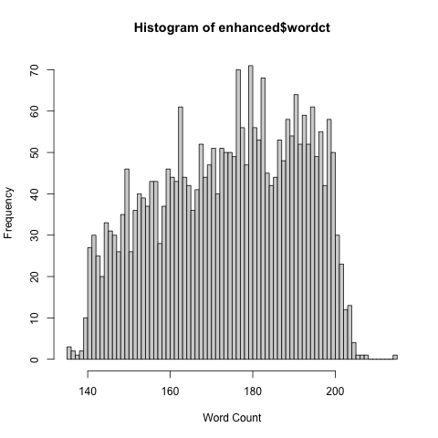
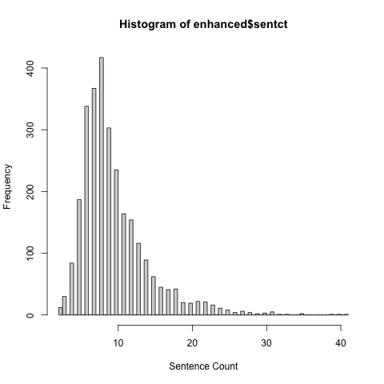

## Kaggle: CommonLit Readability Prize

### 1. Explore data
* There are 2834 rows of reading excerpts.
* The word counts of the excerpts are distributed as follows:

* The sentence count can be quite long. I suspect that a high sentence count correlates with a lower reading level, but we'll see.

### 2. Try various regressions/decision trees without text
### 3. Include tfidf
### 4. Check for the presence of adverbs, number of different pronouns, number of adjectives, etc
### 5. Try word2vec
